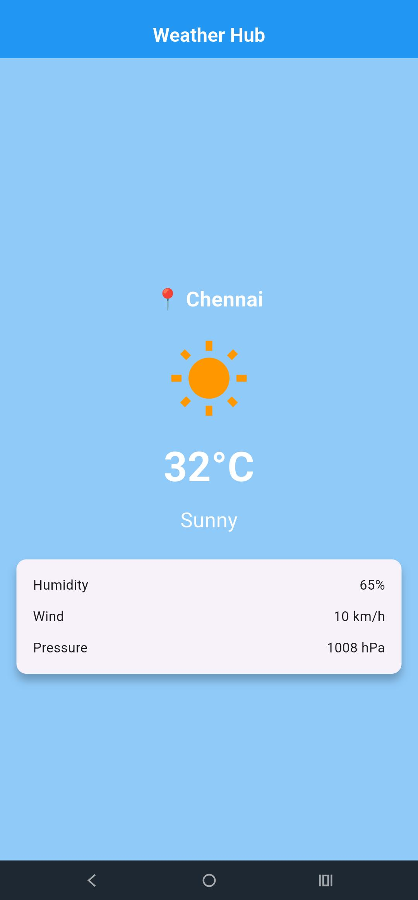

# 🌤️ Weather Hub

A simple Weather application developed using **Flutter** and **Dart**. The app displays weather information for a city with a clean and attractive user interface, including temperature, weather condition, humidity, wind speed, and atmospheric pressure.

## 📱 Features

- 🌍 Displays city name
- 🌤️ Shows current weather condition
- 🌡️ Displays current temperature
- 💧 Shows humidity percentage
- 💨 Displays wind speed
- 🌍 Shows atmospheric pressure
- 🎨 Clean and responsive Material Design UI

## 🛠️ Technologies Used

- Flutter
- Dart
- Material Design
- Visual Studio Code / Android Studio

## 🚀 How It Works

The application displays static weather information for **Chennai**, including:

- 📍 Location: Chennai
- 🌤️ Weather: Sunny
- 🌡️ Temperature: 32°C
- 💧 Humidity: 65%
- 💨 Wind Speed: 10 km/h
- 🌍 Pressure: 1008 hPa

The weather details are displayed inside a modern card layout with a simple and attractive interface.

## 📸 Screenshot



## ▶️ Installation

1. Clone the repository

```bash
git clone https://github.com/kumaresh555/WeatherHub.git
```

2. Navigate to the project folder

```bash
cd WeatherHub
```

3. Install dependencies

```bash
flutter pub get
```

4. Run the application

```bash
flutter run
```

## 📋 Requirements

- Flutter SDK
- Dart SDK
- Android Studio or Visual Studio Code
- Android Emulator or Physical Device

## 💡 Future Improvements

- 🌐 Integrate a real-time Weather API
- 📍 Detect current location automatically
- 🔍 Search weather by city name
- 📅 7-day weather forecast
- ⏰ Hourly weather updates
- 🌙 Dark Mode support
- 🌦️ Dynamic weather icons and animations

## 👨‍💻 Author

Kumaresh S

Intern ID: CITS4419

GitHub: https://github.com/kumaresh555

## 📄 License

This project is developed for learning and educational purposes.

## ⭐ Output

The application provides a simple and elegant weather dashboard displaying the current weather details for a selected city with an intuitive and user-friendly interface.
